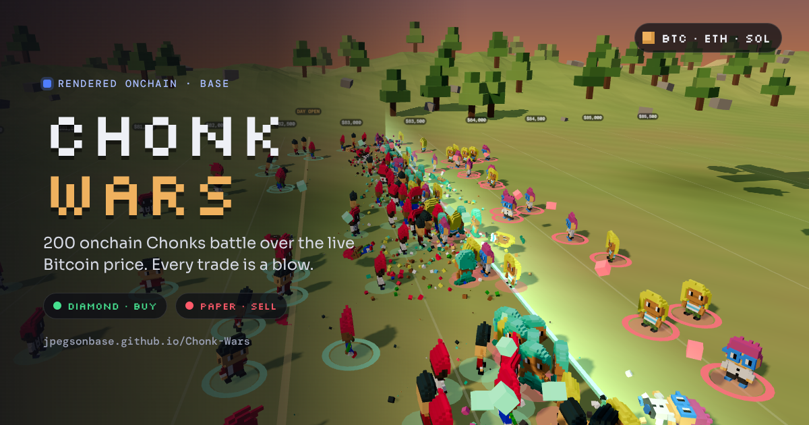

# Chonk-Wars

A live price tracker for Bitcoin, Ethereum, and Solana. But chonky!

Two armies of [Chonks](https://basescan.org/token/0x07152bfde079b5319e5308c43fb1dbc9c76cb4f9) fight over the live price. Diamond Chonks (buyers) hold the left, Paper Chonks (sellers) hold the right, and the frontline sits exactly where the price is. Every trade on the market lands as a blow on the battlefield.

**Play it:** open `index.html` in a browser, or visit the GitHub Pages site once it's switched on.

## Rendered straight from the chain

No images and no indexer. Every soldier is rebuilt in the browser from voxel data stored onchain:

- Reads the 200 soldiers from wallet `0xb120839bfb092cef28315e6c35a0797e1952d535` via `walletOfOwner()` on the ChonksMain contract on Base (`0x07152bfde079b5319e5308c43fb1dbc9c76cb4f9`).
- Fetches each Chonk's 3D voxel map with `getChonkZMap(tokenId)` through public Base RPCs.
- Every distinct look in the wallet is used before any lookalike, so all 200 soldiers are different tokens.
- Animated with the same rig and walk cycle as the Chonks playground, and drawn as one batched mesh.

Want your own army? Add `?wallet=0xYourAddress` to the link (or use **Army & heroes → Your army**) and every soldier comes from that wallet.

If Base can't be reached, it falls back to six built-in sample Chonks.

## How the market drives the battle

Live data comes from Binance's public trade and order-book streams. If those can't be reached, the price is simulated and a badge says so.

| Market | On the battlefield |
| --- | --- |
| Price vs today's open | Where the frontline sits; a rising price pushes it right |
| Order-book depth | How many Chonks each side fields |
| Recent buy vs sell flow | Which side swings and throws faster |
| Trades | Throws of pixel cubes |
| Whale trades ($250k+ on BTC) | A giant green or red candle crashes into the enemy |
| Sharp moves (0.08% in 5s on BTC) | A bomber drops up to three bombs |

Brawlers charge the line and fight hand to hand. About 1 in 5 Chonks are throwers that hang back and lob cubes from range.

## Controls

| | |
| --- | --- |
| **Play** | Take control of a Chonk (or click any Chonk, then **Control**) |
| WASD / arrows | Move |
| Mouse | Aim |
| Click / Space | Throw a cube |
| Esc | Hand your Chonk back to the AI |
| 1 / 2 / 3 | Cinematic, Follow and Free cameras |
| Army & heroes → Your army | Rebuild both sides from only your wallet's Chonks (copies fill each side to 100 if you hold fewer) |
| Army & heroes → Enlist | Add any token ID or wallet's Chonks as heroes |
| Audio | Music and sound-effect sliders, plus a mute toggle (or press M) |
| Call airstrike | A bomber drops 8 bombs straight down the frontline, hitting both sides (12s cooldown) |

On phones: drag on the left side of the screen to move, tap to throw.

## Credits

Inspired by [Bitcoin Battlefield](https://bitcoinbattlefield.com/) by Nick Greenawalt. Built with [three.js](https://threejs.org/). Chonks are onchain on Base.
